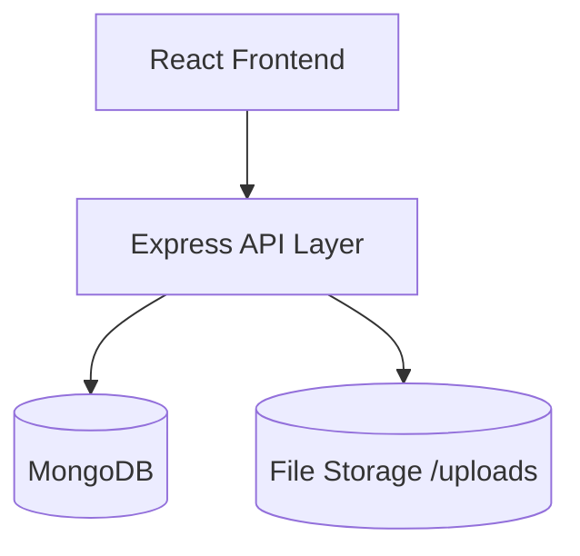
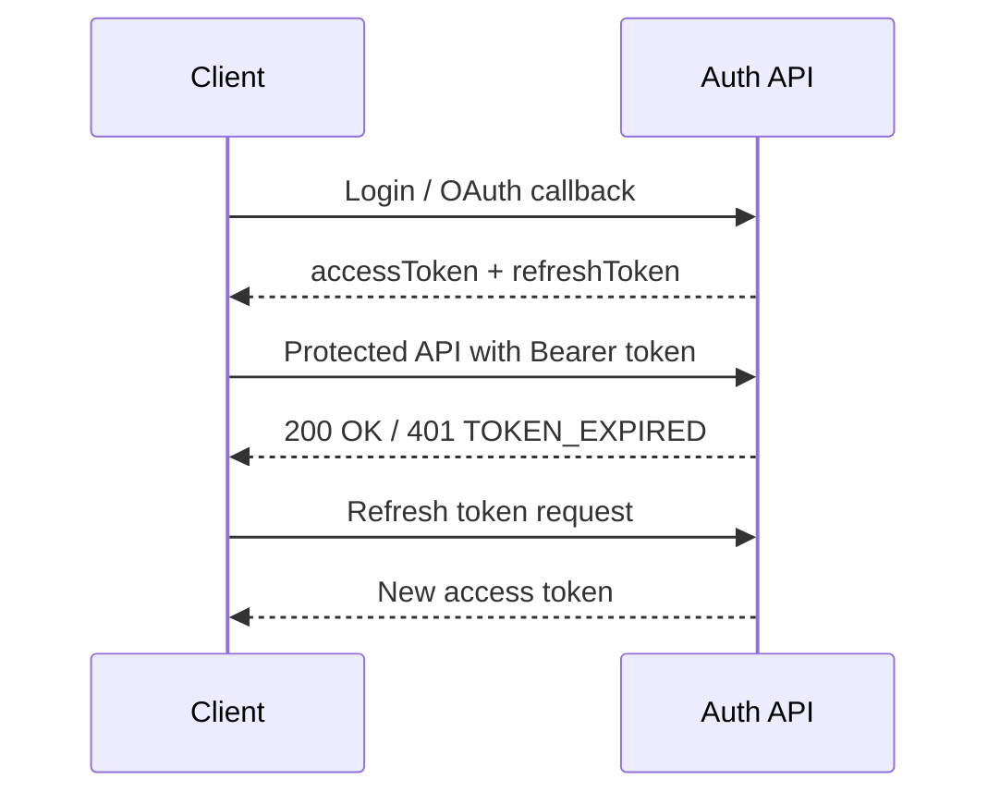
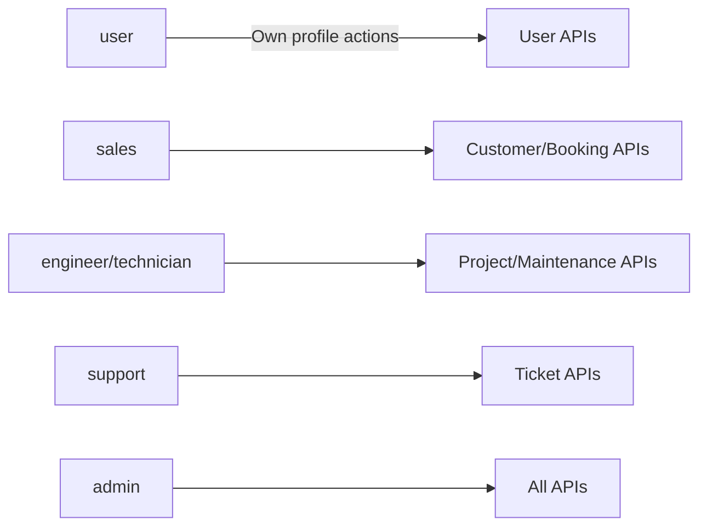
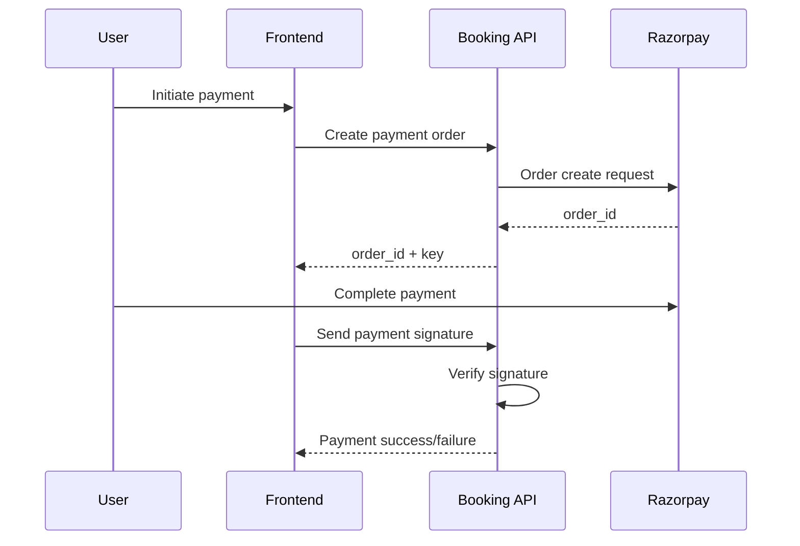
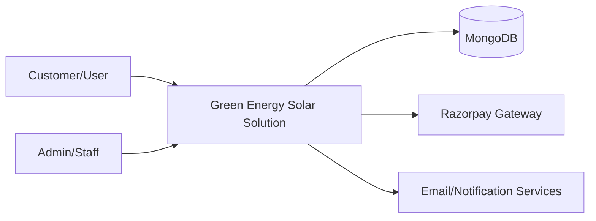
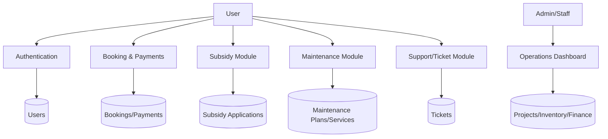
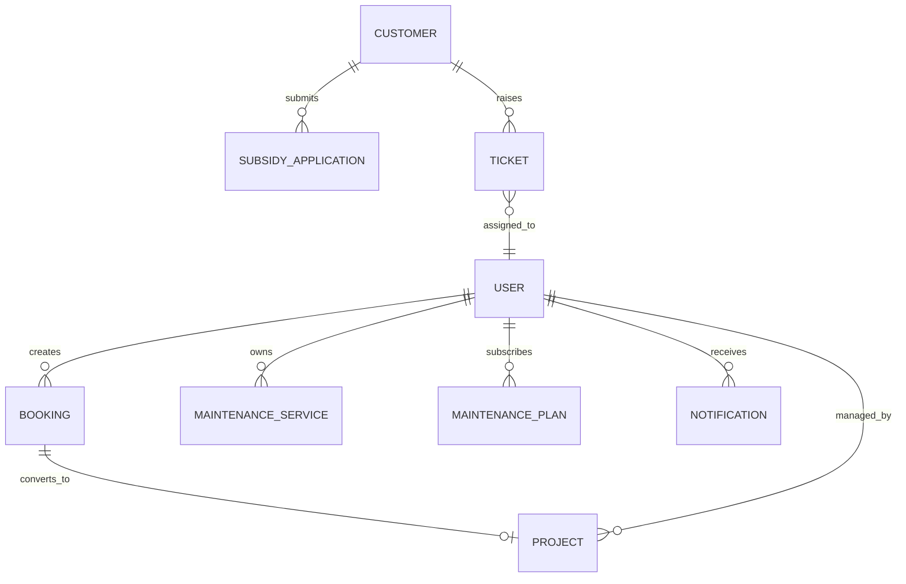
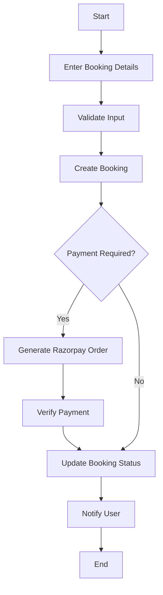
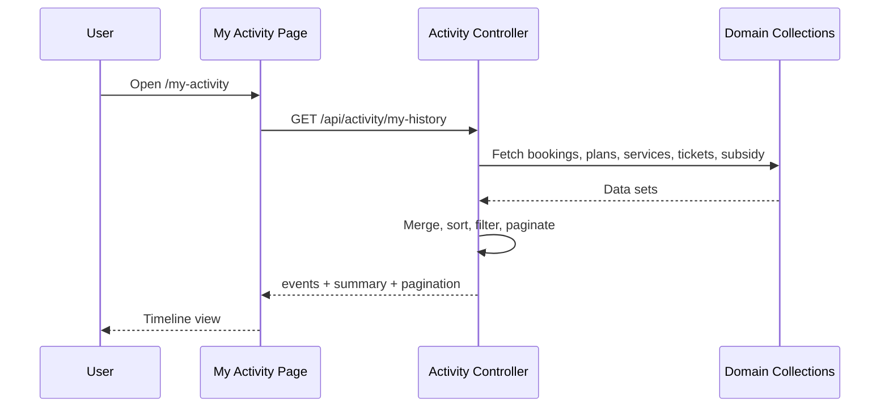

# GREEN ENERGY SOLAR SOLUTION
## Full Stack Solar Energy Management and Service Platform

### Final Year Internship Project Report (BCA)

Prepared For: Department of Computer Applications, Dharmsinh Desai University, Nadiad  
Prepared By: [Student Name] ([Enrollment No.])  
Company/Industry Mentor: [Mentor Name], [Company Name]  
Academic Year: 2025-2026

---

## Formatting Specification (For Final Word/PDF Submission)

- Font Family: Times New Roman
- Heading Size: 16 pt, Bold
- Body Text: 12 pt
- Line Spacing: 1.5
- Alignment: Justified
- Page Size: A4

Note: This manuscript is provided in Markdown for easy editing and conversion to DOCX/PDF.

---

## 1. Cover Page

**Project Title:** Green Energy Solar Solution - Solar Energy Management and Service Platform  
**Project Type:** Final Year Internship Project  
**Degree:** Bachelor of Computer Application (BCA)  
**University:** Dharmsinh Desai University, Nadiad  
**Prepared By:** [Student Name], [Enrollment No.]  
**Organization:** [Company Name], [City]  
**Guide:** [Internal Guide Name]  
**Industry Mentor:** [Industry Mentor Name]  
**Submission Date:** [Date]

---

## 2. Certificate Page

This is to certify that the project report entitled **"Green Energy Solar Solution - Solar Energy Management and Service Platform"** submitted by **[Student Name] ([Enrollment No.])** in partial fulfillment of the requirements for the award of the degree of **Bachelor of Computer Application (BCA)** to **Dharmsinh Desai University, Nadiad**, is a bonafide record of work carried out during the academic year **2025-2026** under our guidance.

| Signatory | Name | Designation | Signature | Date |
|---|---|---|---|---|
| Internal Guide | [Name] | Faculty Guide |  |  |
| Industry Mentor | [Name] | Project Mentor |  |  |
| HOD | [Name] | Head, Department of Computer Applications |  |  |

---

## 3. Declaration Page

I, **[Student Name]**, hereby declare that the project report titled **"Green Energy Solar Solution - Solar Energy Management and Service Platform"** is my original work carried out under the supervision of the faculty guide and industry mentor. This report has not been submitted to any other university or institution for the award of any degree or diploma.

I further declare that all references used in this report have been properly acknowledged.

**Place:** Nadiad  
**Date:** [Date]  
**Signature of Student:** ______________________

---

## 4. Acknowledgement

I express my sincere gratitude to **Dharmsinh Desai University, Nadiad**, for providing the academic framework and opportunity to undertake this internship project. I am thankful to my internal guide **[Guide Name]** for continuous support, valuable technical suggestions, and structured review inputs throughout the project lifecycle.

I also extend my thanks to **[Company Name]** and my industry mentor **[Mentor Name]** for enabling practical exposure to full-stack web development, deployment practices, and software delivery discipline in a real-world engineering environment.

I am deeply grateful to my family and friends for their encouragement, patience, and motivation during this work.

---

## 5. Abstract

The **Green Energy Solar Solution** system is a web-based platform designed to digitize the solar customer lifecycle, from initial booking to installation tracking, maintenance services, subsidy processing, support ticketing, and analytics. The project addresses common operational challenges in distributed solar service businesses, such as fragmented data, delayed communication, manual status tracking, weak role control, and inconsistent service visibility.

The system is developed using the **MERN stack**: **MongoDB**, **Express.js**, **React.js**, and **Node.js**. It supports **JWT-based authentication**, **Google OAuth**, **role-based access control**, **Razorpay payment integration**, and modular APIs for business domains such as booking, maintenance, subsidy, project tracking, inventory, finance, leads, ticketing, and recommendations.

The frontend offers separate experiences for public users, customers, and internal staff through protected routes and role-aware dashboards. The backend provides secure REST APIs, middleware-driven authorization, and normalized data handling. In addition, the platform includes an integrated **user activity history module**, export-ready reporting support, and communication utilities through notifications and email workflows.

This internship project demonstrates the application of modern full-stack engineering practices to build a production-oriented management system aligned with digital transformation goals in the renewable energy domain.

**Keywords:** MERN, Solar CRM, Booking Management, Maintenance Workflow, Subsidy Tracking, RBAC, JWT, Razorpay, Activity Timeline, Cloud Deployment

---

## 6. Table of Contents

1. Cover Page  
2. Certificate Page  
3. Declaration Page  
4. Acknowledgement  
5. Abstract  
6. Table of Contents  
7. List of Figures  
8. List of Tables  
9. Abbreviations  
10. Chapter 1: Introduction  
11. Chapter 2: Organization Overview  
12. Chapter 3: Literature Review  
13. Chapter 4: System Architecture  
14. Chapter 5: Technology Stack  
15. Chapter 6: Requirement Analysis  
16. Chapter 7: System Design  
17. Chapter 8: Database Design  
18. Chapter 9: System Implementation  
19. Chapter 10: System Testing  
20. Chapter 11: Scope and Limitations  
21. Chapter 12: Future Enhancements  
22. Chapter 13: Conclusion  
23. Chapter 14: References and Bibliography

---

## 7. List of Figures

- Figure 4.1 Three-Tier Architecture
- Figure 4.2 Authentication and Authorization Architecture
- Figure 4.3 Role-Based Access Control Model
- Figure 7.1 End-to-End System Flow
- Figure 7.2 Booking and Payment Flow
- Figure 7.3 Data Flow Diagram (Context Level)
- Figure 7.4 Data Flow Diagram (Level 1)
- Figure 7.5 ER Diagram (Conceptual)
- Figure 7.6 Use Case Diagram
- Figure 7.7 Activity Diagram (Booking)
- Figure 7.8 Sequence Diagram (Activity Timeline)

---

## 8. List of Tables

- Table 2.1 Organization Services
- Table 3.1 Comparative Review of Existing Platforms
- Table 5.1 Technology Stack Summary
- Table 6.1 Functional Requirements
- Table 6.2 Non-Functional Requirements
- Table 6.3 Hardware and Software Requirements
- Table 8.1 Collections and Purpose
- Table 8.2 Data Dictionary (Users)
- Table 8.3 Data Dictionary (Bookings)
- Table 8.4 Data Dictionary (Subsidy Applications)
- Table 8.5 Data Dictionary (Tickets)
- Table 10.1 Functional Test Cases
- Table 10.2 Authentication Test Cases
- Table 10.3 Payment Test Cases
- Table 10.4 Role Permission Test Cases
- Table 10.5 Report Export Test Cases

---

## 9. Abbreviations

| Abbreviation | Expanded Form |
|---|---|
| API | Application Programming Interface |
| RBAC | Role-Based Access Control |
| JWT | JSON Web Token |
| UI | User Interface |
| UX | User Experience |
| DB | Database |
| DFD | Data Flow Diagram |
| ERD | Entity Relationship Diagram |
| OAuth | Open Authorization |
| KPI | Key Performance Indicator |
| CRM | Customer Relationship Management |
| SLA | Service Level Agreement |

---

# CHAPTER 1 - INTRODUCTION

## 1.1 Introduction to Solar Service Management Systems

The distributed solar energy ecosystem includes customer onboarding, technical assessment, booking conversion, installation execution, subsidy processing, maintenance compliance, and long-term service support. Traditional handling of these operations through spreadsheets and disconnected tools causes data redundancy, poor traceability, delayed approvals, and customer dissatisfaction.

A digital platform that unifies these workflows is essential for operational transparency and business scalability. The Green Energy Solar Solution platform addresses this need through role-aware modules, automated status flows, and centralized data management.

## 1.2 Project Overview

Green Energy Solar Solution is a full-stack web platform that provides:

- Customer-facing modules for booking, subsidy application, maintenance, support, and activity history.
- Admin and staff modules for customer management, bookings, subsidy review, project tracking, inventory, finance, and ticket resolution.
- Secure authentication and authorization, payment orchestration, and analytics support.

## 1.3 Objectives of the System

1. Digitize the complete customer lifecycle from inquiry to after-sales service.
2. Provide real-time status visibility for bookings, subsidy, and maintenance.
3. Enable secure and role-based access for internal teams.
4. Integrate digital payments and reduce manual reconciliation errors.
5. Improve service quality using ticketing, notifications, and historical tracking.
6. Support management decisions through analytics and exportable reports.

## 1.4 Importance of Digital Service and Payment Systems

Digital systems improve process integrity by enforcing validation, maintaining auditable trails, and reducing dependence on manual interventions. In this project, digital payments and controlled role permissions ensure secure transaction handling and reduce fraudulent or duplicate operations.

## 1.5 Key Features of the System

- User registration/login with JWT and refresh token mechanism.
- Google OAuth login.
- Solar booking with quotation and payment stages.
- Razorpay payment order creation and signature verification.
- Subsidy application and approval workflow.
- Maintenance subscription and service scheduling.
- Ticket lifecycle with assignment and response tracking.
- Project stage tracking from survey to go-live.
- Inventory and financial analytics modules.
- Unified user activity timeline with filters and pagination.
- CSV/PDF data export support.

## 1.6 System Classification

- Category: Web-based Enterprise Management Information System
- Deployment Model: Cloud-ready client-server architecture
- User Type: B2C + Internal Operations (Admin/Staff)
- Security Model: Token-based authentication with RBAC
- Data Model: Document-oriented NoSQL (MongoDB)

---

# CHAPTER 2 - ORGANIZATION OVERVIEW

## 2.1 Company Profile

The internship organization, **[Company Name]**, operates in software development and digital transformation services with project engagements in business process automation. The organization emphasizes practical software engineering, modular architecture, and client-oriented deployment.

## 2.2 Vision and Mission

**Vision:** To build scalable digital products that solve real-world business inefficiencies.  
**Mission:** To deliver secure, maintainable, and user-centric software through modern engineering practices.

## 2.3 Services Offered

| Service Area | Description |
|---|---|
| Web Application Development | End-to-end full-stack development |
| API Engineering | RESTful backend architecture and integrations |
| Cloud Deployment | Hosted deployment and environment management |
| UI/UX Engineering | Responsive interface design and usability improvements |
| Maintenance and Support | Production support and iterative enhancement |

## 2.4 Development Methodology

The project followed an **iterative Agile-inspired model**:

1. Requirement understanding and module decomposition.
2. API-first backend implementation.
3. Frontend integration and route-level security.
4. Iterative testing and bug-fixing cycles.
5. Deployment readiness and documentation.

## 2.5 Organization Structure

| Role | Responsibility |
|---|---|
| Project Mentor | Technical guidance and milestone reviews |
| Full-Stack Developer Intern | Design, implementation, integration, testing |
| QA/Reviewer | Validation of workflows and bug reporting |
| Stakeholders | Feature validation and domain feedback |

---

# CHAPTER 3 - LITERATURE REVIEW

## 3.1 Existing Platforms and Digital Operations Tools

Existing service-management products in adjacent domains provide customer portals, payment integration, and support workflows. However, many platforms are generic and do not align with solar-specific requirements such as subsidy processing, installation stage tracking, and maintenance-specific schedules.

## 3.2 Market Analysis of Comparable Platforms

| Platform Type | Strengths | Limitations for Solar Domain |
|---|---|---|
| Generic CRM | Lead management, communication tracking | Limited technical workflow support |
| Helpdesk Systems | Ticket lifecycle and SLA tracking | No booking/subsidy/install integration |
| Payment-first Platforms | Fast transaction workflows | Weak operational process integration |
| Spreadsheet-based Management | Low entry barrier | Data inconsistency, no real-time visibility |

## 3.3 Limitations of Existing Approaches

1. Data silos across booking, support, and finance teams.
2. Lack of role-scoped dashboards and restricted access control.
3. Weak subsidy tracking and approval transparency.
4. Minimal audit trail for customer lifecycle events.
5. Insufficient analytics for forecasting and operational planning.

## 3.4 Research Gap and Contribution

The system contributes a unified, role-aware platform that combines customer workflows, operational controls, and analytics in one architecture. The activity timeline and modular route strategy improve traceability and maintainability.

---

# CHAPTER 4 - SYSTEM ARCHITECTURE

## 4.1 Three-Tier Architecture

The system follows a three-tier pattern:

1. Presentation Tier: React frontend for public, user, and admin/staff portals.
2. Application Tier: Node.js/Express APIs implementing business logic.
3. Data Tier: MongoDB storing domain entities and transactional records.

## 4.2 Frontend Architecture

- Central route orchestration in `frontend/src/App.js`.
- Context providers for authentication and localization.
- ProtectedRoute abstraction for role-based page access.
- Modular service files for API interaction.
- Admin layout separation for enterprise dashboard UX.

## 4.3 Backend Architecture

- Entry server in `Backend/Server.js`.
- Route-per-domain structure under `Backend/server/routes`.
- Controller-based business logic separation.
- Middleware for auth, role checks, and shared validation.
- Environment-driven config for JWT, OAuth, and payment gateways.

## 4.4 Database Architecture

MongoDB stores normalized document collections for users, customers, bookings, tickets, maintenance entities, subsidy entities, inventory, and analytics-related objects.

Primary relationships use ObjectId references across collections, for example:

- Booking -> User, Customer
- Ticket -> Customer, User (assignee)
- Project -> Booking, Customer, User
- SubsidyApplication -> Customer

## 4.5 Authentication Architecture

- JWT-based access token in Authorization header.
- Refresh token flow on token expiration.
- Google OAuth callback support through Passport.
- Invalid or expired token handling with explicit error codes.

## 4.6 Payment Gateway Architecture

- Booking payment order creation with Razorpay API.
- Server-side transaction cap enforcement.
- Signature verification for payment authenticity.
- Payment metadata persisted in booking record.

## 4.7 Role-Based Access Control (RBAC) System

Defined roles include `admin`, `sales`, `engineer`, `technician`, `support`, and `user`.

- Route-level protection on frontend pages.
- Middleware-level role authorization in backend.
- Permission helper for fine-grained capability control.

## 4.8 QR Validation Architecture (Domain Adaptation Note)

The current system implements support-ticket validation and lifecycle checks, but **QR scanner-based validation is not currently implemented** in production modules. This section can be retained as future extensibility for field service verification tokens.

---

# CHAPTER 5 - TECHNOLOGY STACK

## 5.1 Stack Summary

| Layer | Technology | Purpose |
|---|---|---|
| Frontend | React.js | SPA interface and role-based UI rendering |
| Backend | Node.js + Express.js | REST API and business logic |
| Database | MongoDB + Mongoose | Document storage and schema modeling |
| Authentication | JWT, Passport, Google OAuth | Secure access and third-party login |
| Payments | Razorpay | Order/payment processing |
| Testing Tool | Thunder Client/Postman | API test execution |
| Deployment | Render/Cloud hosting-ready | Production deployment |

## 5.2 React.js

React enables reusable component architecture, route-driven rendering, context-based state sharing, and modular service integration. It improves maintainability for multi-role frontend requirements.

## 5.3 Node.js and Express.js

Node.js provides asynchronous event-driven execution suited to high I/O API workloads. Express simplifies route management, middleware composition, and endpoint modularization.

## 5.4 MongoDB

MongoDB supports flexible schema evolution for changing business requirements. Mongoose adds validation, references, middleware hooks, and model organization.

## 5.5 JWT and OAuth

JWT ensures stateless auth for APIs, while OAuth improves onboarding convenience and security for authenticated users via trusted identity providers.

## 5.6 Razorpay

Razorpay integration supports payment order creation, payment status verification, and secure transaction signature checks.

## 5.7 PDF/CSV/Excel Tooling

The codebase includes utilities and dependencies for generating downloadable reports in multiple formats, helping operations and management teams.

## 5.8 Deployment on Render (Cloud)

The architecture is cloud-compatible with environment configuration support for production URL mapping, secure keys, and scalable API hosting.

---

# CHAPTER 6 - REQUIREMENT ANALYSIS

## 6.1 Functional Requirements

| FR ID | Requirement | Priority |
|---|---|---|
| FR-01 | User registration and login | High |
| FR-02 | JWT-based secure API access | High |
| FR-03 | Role-based route access and authorization | High |
| FR-04 | Booking creation and status tracking | High |
| FR-05 | Maintenance plan subscription and service records | High |
| FR-06 | Subsidy application and admin review | High |
| FR-07 | Ticket creation, assignment, and responses | High |
| FR-08 | Project stage tracking and updates | Medium |
| FR-09 | Inventory and finance modules | Medium |
| FR-10 | Notifications/messages and history timeline | Medium |
| FR-11 | CSV/PDF report export | Medium |

## 6.2 Non-Functional Requirements

| NFR ID | Requirement | Target |
|---|---|---|
| NFR-01 | Security | JWT validation, role checks, protected APIs |
| NFR-02 | Performance | Average API response < 2 seconds for regular queries |
| NFR-03 | Availability | 24x7 cloud availability with monitoring |
| NFR-04 | Scalability | Modular route/controller architecture |
| NFR-05 | Maintainability | Domain-based folder structure |
| NFR-06 | Usability | Responsive and role-specific dashboards |
| NFR-07 | Reliability | Input validation and error handling middleware |

## 6.3 Hardware Requirements

| Component | Minimum |
|---|---|
| Processor | Intel i5 / equivalent |
| RAM | 8 GB |
| Storage | 256 GB SSD |
| Internet | Stable broadband for API/cloud testing |

## 6.4 Software Requirements

| Component | Version/Type |
|---|---|
| Operating System | Windows/Linux/macOS |
| Runtime | Node.js LTS |
| Package Manager | npm |
| Database | MongoDB Atlas / local MongoDB |
| IDE | VS Code |
| API Tool | Thunder Client / Postman |
| Browser | Chrome/Edge/Firefox |

---

# CHAPTER 7 - SYSTEM DESIGN

## 7.1 System Flow

1. User authenticates through credentials or Google OAuth.
2. User performs business actions (booking, subsidy, maintenance, support).
3. Backend validates token and role permissions.
4. Domain controllers persist and retrieve data from MongoDB.
5. UI displays status and analytics, with export options when required.

## 7.2 Booking Flow

1. Customer enters booking details.
2. System calculates costs and creates booking record.
3. If payment needed, Razorpay order is generated.
4. Payment verification updates booking payment status.
5. Booking progresses through review, scheduling, and completion.

## 7.3 Payment Flow

## 7.4 Scanner Validation Flow (Adapted)

The project currently uses status-based ticket and service validation. QR scanner validation can be treated as a future enhancement where field staff verify service tokens using signed QR payloads.

## 7.5 Data Flow Diagram (Context Level)

## 7.6 Data Flow Diagram (Level 1)

## 7.7 ER Diagram (Conceptual)

## 7.8 Use Case Diagram (Textual)

Actors: User, Admin, Sales, Engineer/Technician, Support

- User: Register/Login, Book Solar Service, Apply for Subsidy, Track Status, Raise Ticket, View Activity.
- Sales: Manage customers and booking pipeline.
- Engineer/Technician: Track installations and maintenance services.
- Support: Handle tickets and communication.
- Admin: Global management, analytics, role and system controls.

## 7.9 Activity Diagram (Booking)

## 7.10 Sequence Diagram (My Activity)

---

# CHAPTER 8 - DATABASE DESIGN

## 8.1 Collection Overview

| Collection | Purpose |
|---|---|
| users | Authentication and role identity |
| customers | Customer business profile |
| bookings | Solar booking and payment lifecycle |
| maintenanceplans | Subscription plans |
| maintenanceservices | Scheduled/completed services |
| subsidyapplications | Subsidy process records |
| tickets | Support lifecycle management |
| projects | Installation execution stages |
| inventoryitems | Stock records |
| inventorymovements | Stock in/out audit trail |
| leads | CRM lead pipeline |
| notifications | User alerts |
| messages | In-app message records |

## 8.2 Schema Design Principles

1. ObjectId references for inter-collection linkage.
2. Timestamps for audit and chronology.
3. Enum constraints for status integrity.
4. Optional nested subdocuments for stage-level detail.

## 8.3 Data Dictionary - Users (Sample)

| Field | Type | Constraint | Description |
|---|---|---|---|
| name | String | Required | Full name |
| email | String | Required, Unique | Login identity |
| password | String | Required | Hashed password |
| role | String | Enum | user/admin/sales/engineer/technician/support |
| refreshToken | String | Optional | JWT refresh workflow |
| isActive | Boolean | Default true | Account status |
| createdAt | Date | Auto | Record creation time |

## 8.4 Data Dictionary - Bookings (Sample)

| Field | Type | Constraint | Description |
|---|---|---|---|
| bookingId | String | Unique | Human-readable booking reference |
| user | ObjectId | Required | Linked user |
| customer | ObjectId | Optional | Linked customer profile |
| systemType | String | Enum | Residential/Commercial/Industrial |
| capacity | Number | Required | Plant capacity (kW) |
| status | String | Enum | Pending to Completed lifecycle |
| quotation.totalCost | Number | Optional | Quotation total |
| payment.razorpayOrderId | String | Optional | Payment order reference |

## 8.5 Data Dictionary - Subsidy Applications (Sample)

| Field | Type | Constraint | Description |
|---|---|---|---|
| customerId | ObjectId | Required | Linked customer |
| status | String | Enum | Applied/Under Review/Approved/Rejected |
| appliedAmount | Number | Default 0 | Requested amount |
| approvedAmount | Number | Optional | Final sanctioned amount |
| appliedDate | Date | Default now | Application date |
| documents | Array | Optional | Uploaded evidence |

## 8.6 Data Dictionary - Tickets (Sample)

| Field | Type | Constraint | Description |
|---|---|---|---|
| ticketNumber | String | Unique | Auto-generated ticket id |
| customerId | ObjectId | Required | Ticket owner |
| category | String | Enum | technical/billing/etc. |
| priority | String | Enum | low/medium/high/urgent |
| status | String | Enum | open/in_progress/pending/resolved/closed |
| assignedTo | ObjectId | Optional | Staff assignee |
| responses | Array | Optional | Discussion log |

## 8.7 Relationship Mapping

- One User to Many Bookings.
- One User to Many Maintenance Services and Plans.
- One Customer to Many Tickets and Subsidy Applications.
- One Booking can map to one Project.
- One Ticket can be assigned to one Staff User at a time.

---

# CHAPTER 9 - SYSTEM IMPLEMENTATION

## 9.1 Authentication Module

- Login/register API handling with token generation.
- Middleware validates bearer token and populates `req.user`.
- Refresh token flow implemented for session continuity.
- Google OAuth callback route supported via Passport strategy.

## 9.2 Event/Service Management Module (Domain Adaptation)

In this system, event management from the demo context is replaced by solar service modules:

- Booking lifecycle management.
- Project tracking from survey to commissioning.
- Maintenance service scheduling.

## 9.3 Booking Module

- User enters project requirements.
- Backend stores booking details and quotation components.
- Status transitions manage operational stages.

## 9.4 Payment Integration Module

- Payment order generation through Razorpay SDK.
- Server-side signature verification.
- Payment metadata linked to booking payment object.

## 9.5 Digital Validation Module

The current implementation validates process status and ownership through authenticated API calls and role checks. QR-based field validation is proposed in future scope.

## 9.6 Support Ticket Module

- Ticket creation by customer.
- Assignment to support/internal roles.
- Response thread and resolution metadata.
- Status evolution with audit-friendly timestamps.

## 9.7 Dashboard and Analytics Module

- Admin-focused dashboards for operational KPIs.
- Finance and inventory modules for business visibility.
- Recommendation and alert support for guided decisions.

## 9.8 Report Export Module

- CSV/PDF export support in report-related modules.
- Utility layer support for PDF/Excel generation in backend dependencies.

## 9.9 CMS and Content/Communication Module

- Landing and legal pages managed in frontend.
- Notifications/messages module for user communication.

## 9.10 Help Center Module

- Ticketing APIs and UI support customer issue handling.
- Email service utilities send event-aware communication.

## 9.11 Activity History Module

- Aggregates records from booking, maintenance, ticket, and subsidy modules.
- Supports module/date filters and pagination.
- Provides timeline and summary counts to the user dashboard.

---

# CHAPTER 10 - SYSTEM TESTING

## 10.1 Testing Strategy

The project applies black-box and API-centric validation with scenario-based test coverage across authentication, booking/payment, role permissions, ticket lifecycle, and reporting.

## 10.2 Functional Testing (Sample)

| TC ID | Module | Test Scenario | Input | Expected Result | Status |
|---|---|---|---|---|---|
| FT-01 | Auth | User login with valid credentials | Valid email/password | Access token generated | Pass |
| FT-02 | Booking | Create booking with mandatory fields | Valid booking payload | Booking stored successfully | Pass |
| FT-03 | Subsidy | Submit subsidy application | Valid documents and details | Record created, status Applied | Pass |
| FT-04 | Ticket | Raise support ticket | Subject and description | Ticket number generated | Pass |
| FT-05 | Activity | View my-history endpoint | Auth token + filters | Sorted/paginated events returned | Pass |

## 10.3 Login Testing

| TC ID | Scenario | Expected |
|---|---|---|
| LT-01 | Invalid token format | 401 Invalid token |
| LT-02 | Expired token | 401 TOKEN_EXPIRED |
| LT-03 | Missing token on protected route | 401 Not authorized |
| LT-04 | Refresh token valid | New access token issued |

## 10.4 Payment Testing

| TC ID | Scenario | Expected |
|---|---|---|
| PT-01 | Payment order generation | order_id returned |
| PT-02 | Signature verification success | Payment marked captured |
| PT-03 | Signature mismatch | Transaction rejected |
| PT-04 | Transaction cap exceeded | Validation error response |

## 10.5 Validation/Workflow Testing

| TC ID | Scenario | Expected |
|---|---|---|
| VT-01 | User accesses own records only | Authorized data only |
| VT-02 | Duplicate/invalid status transition attempt | Validation error |
| VT-03 | Ticket update by unauthorized role | 403 Access denied |

## 10.6 Role Permission Testing

| TC ID | Role | Action | Expected |
|---|---|---|---|
| RB-01 | user | Access admin routes | Denied |
| RB-02 | admin | Access all modules | Allowed |
| RB-03 | support | Manage support tickets | Allowed |
| RB-04 | engineer | Access technical modules | Allowed |
| RB-05 | sales | Access customer/booking views | Allowed |

## 10.7 Report Export Testing

| TC ID | Export Type | Scenario | Expected |
|---|---|---|---|
| EX-01 | CSV | Export activity history | File downloads with records |
| EX-02 | PDF | Export activity report | Printable report generated |
| EX-03 | Filtered Export | Export with date/module filter | Output matches filtered data |

## 10.8 Observations

Testing indicates stable core flow behavior with role checks, payment verification, and timeline aggregation functioning as expected. Further performance tests with larger datasets are recommended before high-scale production rollout.

---

# CHAPTER 11 - SCOPE AND LIMITATIONS

## 11.1 Scope

1. End-to-end customer lifecycle for solar operations.
2. Internal operational dashboard and role-based management.
3. Modular APIs enabling incremental expansion.
4. Cloud deployment readiness and maintainable architecture.

## 11.2 Limitations

1. QR-based field validation is not fully implemented.
2. Some advanced predictive analytics are currently rule-based.
3. Third-party integration resilience depends on external service uptime.
4. Large-scale report generation may require async processing queues in future.

---

# CHAPTER 12 - FUTURE ENHANCEMENTS

## 12.1 Mobile App Development

Develop Android/iOS companion apps for on-field technicians and customer self-service.

## 12.2 AI Recommendation Enhancements

Introduce demand forecasting, failure prediction, and personalized service advisory using historical data.

## 12.3 Blockchain-based Verification (Exploratory)

Investigate tamper-resistant verification for subsidy documents and milestone attestations.

## 12.4 International Deployment

Add multi-currency, tax localization, timezone handling, and region-specific policy support.

## 12.5 Advanced Analytics Dashboard

Build executive KPI dashboards with trend analysis, cohort behavior, and anomaly detection.

## 12.6 QR-Based Service Validation

Implement signed QR payloads for on-site work verification, duplicate prevention, and instant service closure logging.

---

# CHAPTER 13 - CONCLUSION

The Green Energy Solar Solution project demonstrates a practical and scalable implementation of a full-stack enterprise web platform in the renewable energy domain. By integrating booking, subsidy, maintenance, support, project tracking, analytics, and secure payments into a single role-driven architecture, the system significantly improves operational control and customer visibility.

From an academic perspective, the project validates core BCA competencies in requirements engineering, system design, API development, database modeling, authentication security, role-based authorization, integration testing, and technical documentation.

From an industry perspective, the platform provides a realistic foundation for digital process transformation and can be enhanced further through mobile apps, AI analytics, and advanced operational intelligence.

---

# CHAPTER 14 - REFERENCES AND BIBLIOGRAPHY

## 14.1 Books

1. Pressman, R. S., and Maxim, B. R. *Software Engineering: A Practitioner's Approach*. McGraw-Hill.
2. Sommerville, I. *Software Engineering*. Pearson.
3. Elmasri, R., and Navathe, S. *Fundamentals of Database Systems*. Pearson.

## 14.2 Official Documentation

1. React Documentation. https://react.dev/
2. Node.js Documentation. https://nodejs.org/
3. Express.js Documentation. https://expressjs.com/
4. MongoDB Documentation. https://www.mongodb.com/docs/
5. Mongoose Documentation. https://mongoosejs.com/docs/
6. JSON Web Tokens. https://jwt.io/introduction
7. Razorpay API Docs. https://razorpay.com/docs/
8. Passport.js Documentation. https://www.passportjs.org/
9. Render Documentation. https://render.com/docs

## 14.3 Research and Industry Sources

1. IEA renewable energy market reports.
2. MNRE and state-level subsidy policy references (India).
3. Industry whitepapers on CRM-enabled service operations.

---

## Appendix A - API Group Inventory (Current Implementation)

- `/api/auth`
- `/api/users`
- `/api/dashboard`
- `/api/energy`
- `/api/bookings`
- `/api/maintenance`
- `/api/subsidy`
- `/api/subsidy-applications`
- `/api/recommendations`
- `/api/notifications`
- `/api/messages`
- `/api/admin`
- `/api/customers`
- `/api/roles`
- `/api/projects`
- `/api/leads`
- `/api/tickets`
- `/api/activity`
- `/api/finance`
- `/api/inventory`
- `/api/ai`

## Appendix B - Role Matrix (Current Implementation)

| Role | Core Access |
|---|---|
| user | Customer-facing modules |
| admin | Full access |
| sales | Customer and booking-centric operations |
| engineer | Technical execution modules |
| technician | Technical execution and service workflows |
| support | Ticket and support communication modules |

## Appendix C - Submission Checklist

- Cover, certificate, declaration signed.
- Guide and mentor details verified.
- Screenshots inserted per module.
- Test evidence attached.
- Plagiarism check certificate attached (if required).
- Source code and deployment link annexed.
