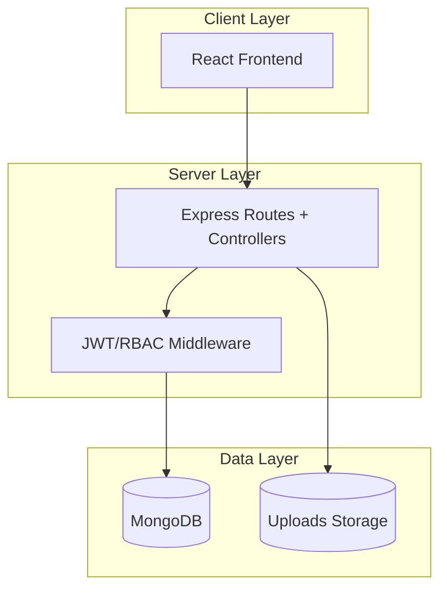
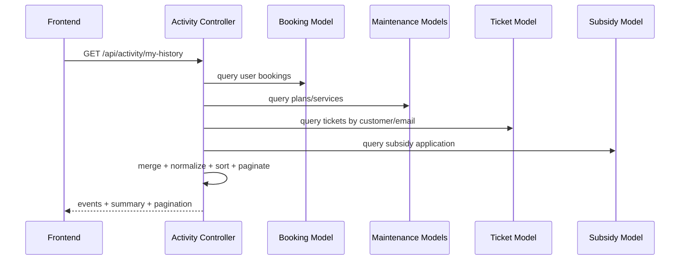
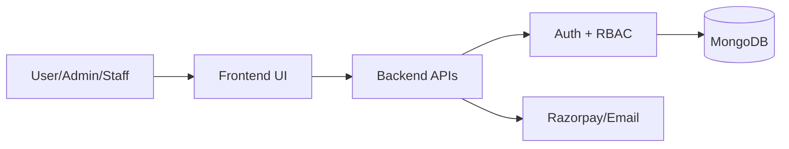
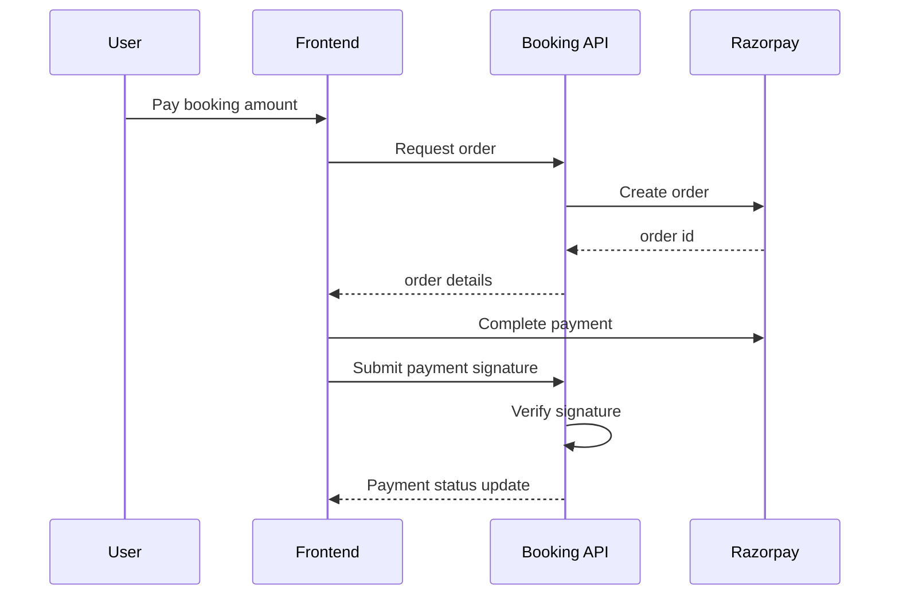
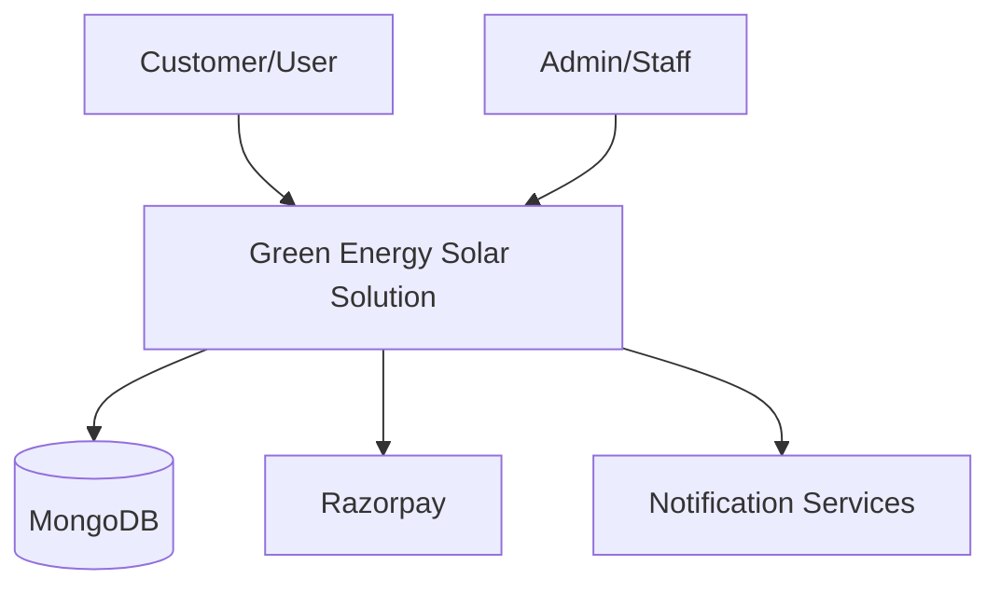
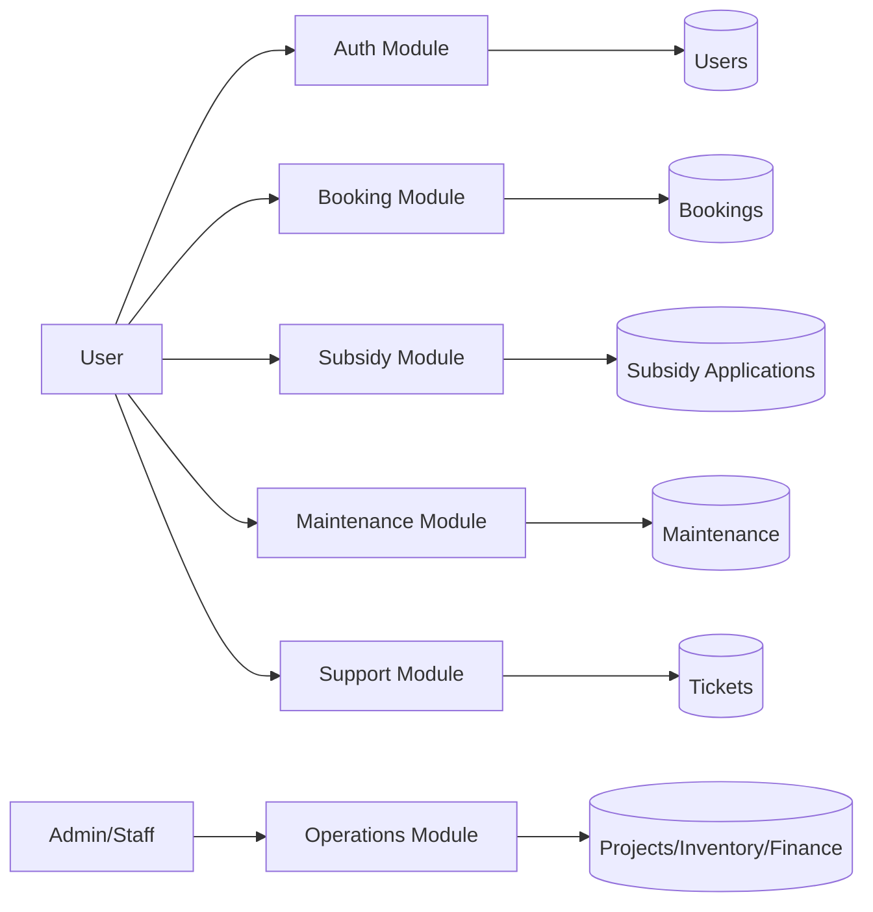
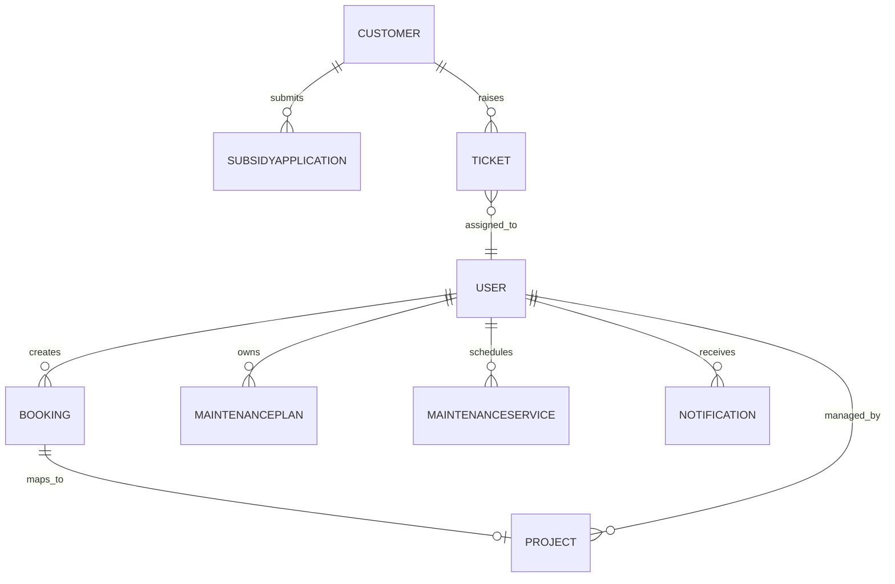
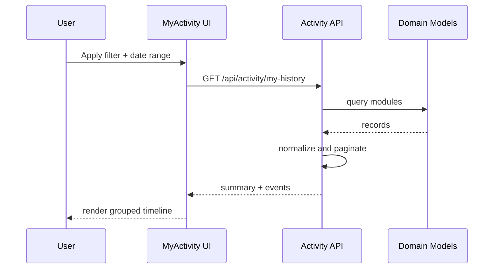

# GREEN ENERGY SOLAR SOLUTION
## A Comprehensive Web-Based Solar Operations and Service Management Platform

### Final Year Internship Project Report (BCA)

**Submitted By:** [Student Name] ([Enrollment No.])  
**Course:** Bachelor of Computer Application (BCA)  
**University:** Dharmsinh Desai University, Nadiad  
**Organization:** [Company Name], [City]  
**Academic Year:** 2025-2026

---

## Document Formatting Instructions (Apply in MS Word)

- Font: Times New Roman
- Heading: 16 pt, Bold
- Body: 12 pt
- Line Spacing: 1.5
- Alignment: Justified
- Page Size: A4
- Margins: 1 inch on all sides
- Page Numbering: Bottom center

---

## 1. Cover Page

**Project Title:** Green Energy Solar Solution - Solar Lifecycle Management Platform  
**Project Type:** Final Year Internship Project  
**Submitted To:** Department of Computer Applications, Dharmsinh Desai University, Nadiad  
**Submitted By:** [Student Name], [Enrollment No.]  
**Company:** [Company Name], [City]  
**Guide:** [Internal Guide Name]  
**Industry Mentor:** [Industry Mentor Name]  
**Date of Submission:** [Date]

---

## 2. Certificate

This is to certify that the project report entitled **"Green Energy Solar Solution - Solar Lifecycle Management Platform"** has been carried out by **[Student Name] ([Enrollment No.])** under our guidance in partial fulfillment of the requirements for the award of the degree of **Bachelor of Computer Application (BCA)** of **Dharmsinh Desai University, Nadiad** for the academic year **2025-2026**.

| Authority | Name | Designation | Signature | Date |
|---|---|---|---|---|
| Internal Guide | [Name] | Faculty Guide |  |  |
| Industry Mentor | [Name] | Project Mentor |  |  |
| HOD | [Name] | Head of Department |  |  |

---

## 3. Declaration

I, **[Student Name]**, hereby declare that the work presented in this project report titled **"Green Energy Solar Solution - Solar Lifecycle Management Platform"** is an original record of work carried out by me during my internship and has not been submitted previously for any degree or diploma in any university.

All sources of information used in this report have been acknowledged appropriately.

**Place:** Nadiad  
**Date:** [Date]  
**Signature:** ______________________

---

## 4. Acknowledgement

I express my sincere gratitude to **Dharmsinh Desai University, Nadiad** for providing the academic framework and opportunity to undertake this internship project.

I am grateful to my faculty guide **[Guide Name]** for regular technical guidance, critical feedback, and motivation throughout the project lifecycle. I also thank my industry mentor **[Mentor Name]** at **[Company Name]** for practical insights into real-world software delivery, quality standards, and deployment practices.

I thank all team members and peers who supported me with module validation, testing feedback, and review suggestions. Finally, I extend heartfelt thanks to my family for their continuous encouragement.

---

## 5. Abstract

The increasing adoption of distributed solar systems has created a need for integrated digital platforms that can handle customer onboarding, booking workflows, subsidy processing, maintenance schedules, service requests, and operational analytics from a single interface. Traditional tools, such as spreadsheets and disconnected software products, often lead to process delays, weak visibility, and data inconsistencies.

This project presents **Green Energy Solar Solution**, a full-stack web platform developed using the **MERN stack** (MongoDB, Express.js, React.js, Node.js). The system supports customer and internal business operations through modular APIs and role-based interfaces. Major capabilities include secure authentication (JWT with refresh token), Google OAuth login, booking and payment workflows with Razorpay integration, subsidy management, maintenance planning, support ticket management, project tracking, inventory and finance modules, and a unified user activity timeline.

The system follows a three-tier architecture and adopts a role-driven access model that separates customer interactions from internal operations. It emphasizes data traceability, maintainability, and scalable module design. From an implementation perspective, the project demonstrates practical software engineering principles across requirement analysis, architecture, database design, backend integration, frontend UX orchestration, and quality testing.

The developed solution offers a robust foundation for digital transformation in renewable energy service operations and can be further extended with advanced analytics, mobile field applications, and predictive intelligence.

**Keywords:** Solar CRM, MERN Stack, RBAC, JWT, Razorpay, Maintenance Workflow, Subsidy Processing, Ticketing, Activity Timeline

---

## 6. Table of Contents

1. Cover Page  
2. Certificate  
3. Declaration  
4. Acknowledgement  
5. Abstract  
6. Table of Contents  
7. List of Figures  
8. List of Tables  
9. Abbreviations  
10. Chapter 1 - Introduction  
11. Chapter 2 - Organization Overview  
12. Chapter 3 - Literature Review  
13. Chapter 4 - System Architecture  
14. Chapter 5 - Technology Stack  
15. Chapter 6 - Requirement Analysis  
16. Chapter 7 - System Design  
17. Chapter 8 - Database Design  
18. Chapter 9 - System Implementation  
19. Chapter 10 - System Testing  
20. Chapter 11 - Scope and Limitations  
21. Chapter 12 - Future Enhancements  
22. Chapter 13 - Conclusion  
23. Chapter 14 - References and Bibliography  
24. Annexures

---

## 7. List of Figures

- Figure 4.1 High-Level Three-Tier Architecture
- Figure 4.2 Frontend Routing and Access Model
- Figure 4.3 Authentication and Token Lifecycle
- Figure 4.4 Backend Domain-Oriented Architecture
- Figure 4.5 Role-Based Access Control Layer
- Figure 7.1 End-to-End Functional Workflow
- Figure 7.2 Booking and Payment Sequence
- Figure 7.3 Support Ticket Resolution Workflow
- Figure 7.4 Activity Timeline Data Aggregation
- Figure 7.5 Data Flow Diagram (Context)
- Figure 7.6 Data Flow Diagram (Level 1)
- Figure 7.7 ER Diagram

---

## 8. List of Tables

- Table 1.1 System Classification
- Table 2.1 Organizational Service Portfolio
- Table 3.1 Comparative Study of Existing Platforms
- Table 5.1 Technology Mapping
- Table 6.1 Functional Requirement Matrix
- Table 6.2 Non-Functional Requirement Matrix
- Table 6.3 Hardware and Software Requirements
- Table 8.1 Collection Mapping and Purpose
- Table 8.2 Data Dictionary - Users
- Table 8.3 Data Dictionary - Bookings
- Table 8.4 Data Dictionary - Subsidy Applications
- Table 8.5 Data Dictionary - Tickets
- Table 8.6 Data Dictionary - Projects
- Table 10.1 Functional Test Cases
- Table 10.2 Authentication Test Cases
- Table 10.3 Payment Test Cases
- Table 10.4 Role and Authorization Test Cases
- Table 10.5 Export and Reporting Test Cases

---

## 9. Abbreviations

| Abbreviation | Meaning |
|---|---|
| API | Application Programming Interface |
| RBAC | Role-Based Access Control |
| JWT | JSON Web Token |
| OAuth | Open Authorization |
| KPI | Key Performance Indicator |
| CRM | Customer Relationship Management |
| UI | User Interface |
| UX | User Experience |
| DB | Database |
| DFD | Data Flow Diagram |
| ERD | Entity Relationship Diagram |
| QA | Quality Assurance |
| SLA | Service Level Agreement |
| PWA | Progressive Web Application |

---

# CHAPTER 1 - INTRODUCTION

## 1.1 Introduction to Digital Solar Operations

The renewable energy sector is rapidly evolving from isolated installation projects to lifecycle-based service businesses. A customer relationship now extends beyond installation and includes subsidy support, maintenance contracts, periodic service, complaint handling, and usage optimization. Organizations operating in this domain require integrated systems that maintain continuity across these stages.

Traditional process management techniques, such as paper forms and disconnected spreadsheets, introduce delay, duplication, and weak accountability. Digital workflow systems help in standardizing operations, reducing errors, and improving decision support through real-time analytics.

## 1.2 Problem Statement

Solar service organizations often face the following challenges:

1. Fragmented customer records across teams.
2. Delayed booking updates and manual communication loops.
3. Lack of transparent subsidy processing.
4. Difficulty in tracking maintenance obligations and service quality.
5. Weak support ticket traceability.
6. Role mismatch and unauthorized data access risks.

The project addresses these issues through a unified platform with role-specific access and centralized domain modules.

## 1.3 Project Overview

Green Energy Solar Solution is designed as a cloud-ready web application to manage end-to-end operations:

- Customer modules: booking, subsidy application, maintenance records, support tickets, profile, notifications, activity timeline.
- Internal modules: admin dashboard, customer management, project tracking, roles, inventory, finance, and ticket resolution.
- Security: JWT auth, refresh token mechanism, OAuth login, and RBAC.
- Integrations: Razorpay payment orchestration and email notifications.

## 1.4 Project Objectives

| Objective ID | Objective |
|---|---|
| O1 | Build a scalable and maintainable full-stack architecture |
| O2 | Digitize booking-to-service lifecycle |
| O3 | Ensure secure and role-controlled access |
| O4 | Integrate reliable payment workflows |
| O5 | Provide operational transparency through dashboards and exports |
| O6 | Improve customer engagement through notifications and support systems |

## 1.5 Scope of the Study

This report covers design, implementation, and testing of the developed web platform. It includes architecture, technology choices, data modeling, module implementation, and quality validation. The study is limited to web deployment and does not include native mobile applications in the current phase.

## 1.6 System Classification

| Parameter | Classification |
|---|---|
| Domain | Renewable Energy Service Management |
| Type | Web-based Management Information System |
| Architecture | Three-Tier Client-Server |
| Database Type | Document-Oriented NoSQL |
| Access Pattern | Multi-role RBAC |
| Deployment Model | Cloud-hostable full-stack app |

## 1.7 Expected Outcomes

1. Reduced manual dependency and process delays.
2. Improved customer visibility across services.
3. Secure and auditable operational workflows.
4. Better managerial control through centralized data.
5. Extensible foundation for future AI and mobile expansion.

---

# CHAPTER 2 - ORGANIZATION OVERVIEW

## 2.1 Company Profile

The internship was carried out at **[Company Name]**, an organization engaged in software product and service development for business process digitization. The organization emphasizes agile execution, modular architecture, and practical deployment readiness.

## 2.2 Vision and Mission

**Vision:** Deliver reliable digital products that improve business productivity and governance.  
**Mission:** Build maintainable software systems using modern development standards, secure integration practices, and user-focused design.

## 2.3 Service Portfolio

| Service Domain | Description |
|---|---|
| Full-Stack Development | Requirement-to-deployment project execution |
| Web API Development | Scalable backend architecture and integrations |
| Cloud Deployment | CI-ready deployable software stacks |
| Product Maintenance | Iterative enhancement and issue resolution |
| Data Workflow Automation | Role-based business process digitization |

## 2.4 Project Development Methodology

The project followed an iterative delivery model:

1. Requirement elicitation and module decomposition.
2. Backend-first API and schema implementation.
3. Frontend route and component integration.
4. Role and authorization hardening.
5. User acceptance feedback and refinement.
6. Documentation and reporting.

## 2.5 Organizational Workflow for Internship Project

| Phase | Activities |
|---|---|
| Planning | Requirement gathering, feasibility analysis |
| Design | Architecture design, route and schema planning |
| Implementation | APIs, frontend modules, auth and integration |
| Testing | Functional, role, payment, and export validation |
| Closure | Documentation, report submission, handover |

## 2.6 Organizational Structure

- Project Mentor: Domain and architecture review.
- Internal Guide: Academic supervision.
- Developer Intern: Full-stack implementation and testing.
- Review Team: Validation and refinement inputs.

---

# CHAPTER 3 - LITERATURE REVIEW

## 3.1 Need for Integrated Lifecycle Platforms

Research in enterprise systems highlights that fragmented tooling increases rework cost, operational latency, and customer churn. Lifecycle platforms reduce process handoff loss and improve service accountability through centralized state and event tracking.

## 3.2 Review of Existing Platforms

| Platform Category | Advantages | Observed Gaps for Solar Domain |
|---|---|---|
| Generic CRM | Contact and lead management | No subsidy/service lifecycle modeling |
| Helpdesk Systems | Ticket SLA and support analytics | Missing booking/payment context |
| Accounting-Centric Tools | Billing and ledger depth | Weak operational workflow integration |
| Spreadsheet-Based Process | Easy start, low cost | High error rates, poor governance |

## 3.3 Academic and Industry Observations

Key findings from software engineering and MIS references indicate:

1. Role segregation significantly reduces unauthorized data operations.
2. Status-based workflows improve traceability and accountability.
3. API modularization supports maintainability and scaling.
4. Event timeline and audit structures improve transparency.

## 3.4 Limitations in Existing Approaches

- Data duplication due to non-normalized records.
- Manual reconciliation in payment and subsidy workflows.
- Delayed service closure due to absent workflow state control.
- Poor communication continuity between customer and support teams.

## 3.5 Contribution of this Project

This project provides a practical integrated architecture that combines customer interactions, internal operations, and analytical visibility. It demonstrates how domain modules can coexist under a secure and scalable role-oriented design.

---

# CHAPTER 4 - SYSTEM ARCHITECTURE

## 4.1 Architectural Principles

The platform architecture is designed based on:

1. Separation of concerns (UI, API, data).
2. Domain modularity (routes/controllers/models by module).
3. Security-first middleware pipeline.
4. Scalable and testable API contracts.
5. Cloud deployment compatibility.

## 4.2 Three-Tier Architecture

### 4.2.1 Presentation Layer

- React SPA with route segmentation.
- Public vs authenticated views.
- Context providers for auth and localization.

### 4.2.2 Application Layer

- Express routers by domain.
- Controllers encapsulate business rules.
- Middleware for cross-cutting concerns.

### 4.2.3 Data Layer

- MongoDB collections with Mongoose schemas.
- Object references for cross-module relationships.

## 4.3 Frontend Architecture

### 4.3.1 Routing Strategy

The frontend route map includes:

- Public routes: landing, about, legal, login, register.
- User routes: dashboard, booking, maintenance, subsidy, support, my-activity.
- Admin routes under layout shell: users, bookings, subsidy applications, finance, inventory, projects, tickets.
- CRM and engineering views with role protection.

### 4.3.2 UI Composition

- Reusable components for navbar, footer, protected route wrappers, cards, notifications.
- Admin layout separates operational views from public pages.
- Service-layer abstraction for API requests.

## 4.4 Backend Architecture

### 4.4.1 API Entry and Route Registration

`Backend/Server.js` initializes:

- Environment and DB connection.
- Express middleware (CORS, JSON parser, Passport init).
- Static upload serving.
- Domain route registration.

### 4.4.2 Domain Routes

Current domain route groups:

- auth, users, dashboard, energy
- bookings, maintenance, subsidy, subsidy-applications
- recommendations, notifications, messages
- admin, customers, roles, projects, leads
- tickets, activity, finance, inventory, ai

### 4.4.3 Middleware Pipeline

1. Request receipt.
2. Token extraction and validation.
3. Role verification.
4. Controller execution.
5. Error handling and response serialization.

## 4.5 Authentication Architecture

### 4.5.1 JWT Access Control

- Access token expected in `Authorization: Bearer <token>`.
- Token decoded and normalized to `req.user`.
- Expired/invalid token responses include explicit error metadata.

### 4.5.2 Refresh Token Flow

- On access token expiry, frontend requests refresh endpoint.
- New access token is stored and original API retried.

### 4.5.3 OAuth Support

Google OAuth login route/callback exists via Passport strategy.

## 4.6 Payment Gateway Architecture (Razorpay)

1. Client requests payment order.
2. Backend validates transaction limits.
3. Razorpay order created server-side.
4. Client completes payment with gateway.
5. Backend verifies signature and updates booking payment status.

## 4.7 Role-Based Access Control Architecture

### 4.7.1 Roles

- user
- admin
- sales
- engineer
- technician
- support

### 4.7.2 Control Points

- Frontend protected routes by role.
- Backend middleware role assertions.
- Permission helper for specific capabilities.

## 4.8 Communication Architecture

- Notification model for in-system alerts.
- Message model for user communication.
- Email service layer for event-triggered emails.

## 4.9 Activity Timeline Aggregation Architecture

The activity module aggregates events from bookings, maintenance plans/services, tickets, and subsidy applications into a unified paginated response for users.

---

# CHAPTER 5 - TECHNOLOGY STACK

## 5.1 Technology Mapping

| Layer | Technology | Rationale |
|---|---|---|
| UI | React.js | Component reuse, route flexibility |
| API | Express.js | Fast REST route composition |
| Runtime | Node.js | Async I/O efficiency |
| Database | MongoDB + Mongoose | Flexible schema evolution |
| Security | JWT + Passport | Secure, standard auth patterns |
| OAuth | Google OAuth 2.0 | Convenient trusted login |
| Payments | Razorpay SDK | Reliable India-focused gateway |
| Testing | Thunder Client/Postman | API validation productivity |
| Deployment | Render-compatible setup | Cloud-ready hosting |

## 5.2 React.js in the Project

- Route-driven architecture for public and private dashboards.
- Service abstraction (`frontend/src/services`) for consistent API communication.
- State management using hooks and context providers.

## 5.3 Node.js and Express.js

- Non-blocking architecture suitable for concurrent API traffic.
- Middleware chaining for auth, role checks, and request handling.
- Modular route files align with business domains.

## 5.4 MongoDB and Mongoose

- Schemas encode status enums and required fields.
- ObjectId references establish relationships.
- Timestamped records support event history and audit needs.

## 5.5 JWT, Refresh Token, and OAuth

- Stateless session management via JWT.
- Refresh mechanism reduces forced re-login.
- OAuth integration improves onboarding UX.

## 5.6 Razorpay Integration

- Server-side order creation and signature verification.
- Payment identifiers persisted with booking records.
- Operationally suitable for digital transaction lifecycle.

## 5.7 Cloud Deployment Considerations

- Environment-based config for secrets and URLs.
- CORS and callback URL management.
- Production monitoring and log visibility required.

## 5.8 Testing and Debug Tooling

- Thunder Client used for endpoint validation.
- Browser dev tools for frontend behavior inspection.
- Runtime logs for token/payment/tracing diagnostics.

---

# CHAPTER 6 - REQUIREMENT ANALYSIS

## 6.1 Requirement Gathering Approach

Requirements were gathered through:

1. Observation of operational workflow and stakeholder interactions.
2. Module-level requirement documentation.
3. Iterative feedback during implementation demos.

## 6.2 Functional Requirements

| ID | Requirement Description | Actor |
|---|---|---|
| FR-01 | Register/Login user accounts | User |
| FR-02 | Authenticate protected API requests | System |
| FR-03 | Create and manage customer records | Admin/Sales |
| FR-04 | Create and monitor bookings | User/Admin |
| FR-05 | Process booking payments | User/System |
| FR-06 | Manage subsidy applications | User/Admin |
| FR-07 | Subscribe and track maintenance | User/Engineer |
| FR-08 | Raise and resolve support tickets | User/Support |
| FR-09 | Manage projects and installations | Admin/Engineer |
| FR-10 | Manage inventory and finance views | Admin |
| FR-11 | Display user activity timeline | User |
| FR-12 | Export report data | Admin/User |

## 6.3 Non-Functional Requirements

| ID | Parameter | Requirement |
|---|---|---|
| NFR-01 | Security | Token validation, role checks, protected routes |
| NFR-02 | Performance | Efficient pagination and filtered retrieval |
| NFR-03 | Availability | Cloud deployability and error resilience |
| NFR-04 | Maintainability | Domain-level modular codebase |
| NFR-05 | Usability | Responsive and intuitive dashboards |
| NFR-06 | Reliability | Robust error handling and safe fallback flows |
| NFR-07 | Scalability | Extensible API and model architecture |

## 6.4 Hardware Requirements

| Component | Minimum | Recommended |
|---|---|---|
| CPU | Intel i5 or equivalent | Intel i7 or equivalent |
| RAM | 8 GB | 16 GB |
| Storage | 256 GB SSD | 512 GB SSD |
| Network | Stable internet | High-speed broadband |

## 6.5 Software Requirements

| Component | Details |
|---|---|
| OS | Windows 10/11, Ubuntu, macOS |
| Node.js | LTS version |
| Package Manager | npm |
| Database | MongoDB Atlas/local instance |
| IDE | VS Code |
| Browser | Chrome/Edge/Firefox |
| API Tool | Thunder Client/Postman |

## 6.6 Feasibility Analysis

### 6.6.1 Technical Feasibility

The stack is modern, industry-standard, and available with strong documentation. Team skills and mentorship supported delivery.

### 6.6.2 Economic Feasibility

Open-source technologies reduce licensing cost. Cloud usage can scale incrementally.

### 6.6.3 Operational Feasibility

Role-based design and workflow alignment make organizational adoption practical.

---

# CHAPTER 7 - SYSTEM DESIGN

## 7.1 Design Goals

1. Modular and maintainable architecture.
2. Secure workflow boundaries.
3. Data traceability and timeline visibility.
4. Extensible integration capability.

## 7.2 High-Level Workflow

## 7.3 Booking Flow Design

1. User fills booking form.
2. Frontend validates mandatory fields.
3. Backend persists booking with initial status.
4. Optional payment order created.
5. Payment verified and booking updated.

## 7.4 Payment Flow Design

## 7.5 Ticket Resolution Flow

1. User raises ticket with category and description.
2. Support/admin assigns ticket.
3. Internal responses recorded.
4. Resolution metadata captured.
5. Ticket moved to resolved/closed states.

## 7.6 Activity Timeline Flow

1. User opens My Activity page.
2. API fetches records from multiple modules.
3. Events normalized and sorted by date.
4. Filter and pagination applied server-side.
5. Summary and event list returned.

## 7.7 Data Flow Diagram - Context Level

## 7.8 Data Flow Diagram - Level 1

## 7.9 ER Diagram (Conceptual)

## 7.10 Use Case Summary

| Actor | Use Cases |
|---|---|
| User | Register/login, booking, subsidy apply, maintenance view, raise ticket, view activity |
| Admin | Manage users/customers, bookings, subsidy approvals, roles, finance, inventory |
| Sales | Customer and booking operations |
| Engineer/Technician | Technical workflow and maintenance execution |
| Support | Ticket handling and communication |

## 7.11 Sequence Diagram - Activity Module

---

# CHAPTER 8 - DATABASE DESIGN

## 8.1 Design Approach

The database is modeled using MongoDB collections with Mongoose schemas. The design balances flexibility and validation using enums, required constraints, and references.

## 8.2 Collections and Purpose

| Collection | Purpose |
|---|---|
| User | Account identity, role, auth metadata |
| Customer | Domain-specific customer details |
| Booking | Booking lifecycle, quotation, payment state |
| SubsidyApplication | Subsidy process and approval data |
| MaintenancePlan | Subscription lifecycle |
| MaintenanceService | Scheduled/completed service records |
| Ticket | Support workflow and resolution history |
| Project | Installation stage and execution tracking |
| InventoryItem | Asset and stock data |
| InventoryMovement | Inventory transaction trail |
| Lead | CRM lead pipeline data |
| Notification | Event alerts |
| Message | Communication records |

## 8.3 Data Dictionary - Users

| Field | Type | Constraint | Description |
|---|---|---|---|
| name | String | Required | User full name |
| email | String | Required, Unique | Login email |
| password | String | Required | Hashed password |
| phone | String | Optional | Contact number |
| role | String | Enum | user/admin/sales/engineer/technician/support |
| isActive | Boolean | Default true | Account state |
| googleId | String | Unique, Sparse | OAuth identity |
| refreshToken | String | Optional | Session continuity |

## 8.4 Data Dictionary - Bookings

| Field | Type | Constraint | Description |
|---|---|---|---|
| bookingId | String | Unique | Business id |
| user | ObjectId | Required | User reference |
| customer | ObjectId | Optional | Customer reference |
| systemType | String | Enum | Residential/Commercial/Industrial |
| capacity | Number | Required | kW capacity |
| status | String | Enum | Booking lifecycle status |
| quotation | Object | Optional | Cost and ROI data |
| payment | Object | Optional | Payment metadata and gateway ids |

## 8.5 Data Dictionary - Subsidy Applications

| Field | Type | Constraint | Description |
|---|---|---|---|
| customerId | ObjectId | Required | Linked customer |
| status | String | Enum | Applied/Under Review/Approved/Rejected |
| appliedAmount | Number | Default 0 | Requested subsidy amount |
| approvedAmount | Number | Nullable | Approved amount |
| creditDate | Date | Nullable | Credit date |
| documents | Array | Optional | Uploaded documents |
| remarks | String | Optional | Admin comments |

## 8.6 Data Dictionary - Tickets

| Field | Type | Constraint | Description |
|---|---|---|---|
| ticketNumber | String | Unique | Auto-generated id |
| customerId | ObjectId | Required | Ticket owner |
| category | String | Enum | Ticket classification |
| priority | String | Enum | low/medium/high/urgent |
| status | String | Enum | open/in_progress/pending/resolved/closed |
| assignedTo | ObjectId | Optional | Staff assignee |
| responses | Array | Optional | Conversation log |
| resolution | Object | Optional | Resolution metadata |

## 8.7 Data Dictionary - Projects

| Field | Type | Constraint | Description |
|---|---|---|---|
| bookingId | ObjectId | Optional | Source booking |
| projectName | String | Required | Project title |
| customerId | ObjectId | Required | Related customer |
| status | String | Enum | survey to completed |
| survey | Object | Optional | Site survey details |
| installation | Object | Optional | Progress activities |
| testing | Object | Optional | Commissioning details |
| goLive | Object | Optional | Operational transition details |

## 8.8 Relationship Model

1. One user can create many bookings.
2. One customer can have multiple tickets and subsidy records.
3. One booking may map to one project.
4. One support ticket can be assigned to one staff user at a time.
5. One user can hold multiple maintenance service records.

## 8.9 Indexing and Query Considerations

Recommended indexes:

- User email (unique).
- Booking user and createdAt.
- Ticket customerId, status, createdAt.
- Subsidy customerId and status.
- Activity module source date fields for efficient timeline queries.

---

# CHAPTER 9 - SYSTEM IMPLEMENTATION

## 9.1 Implementation Strategy

The implementation followed a domain-first strategy where backend contracts were built and tested before complete frontend integration. This reduced API ambiguity and improved module stability.

## 9.2 Authentication Module

### 9.2.1 Features

- Registration and login endpoints.
- JWT token generation and verification.
- Refresh token support.
- OAuth callback token handling.

### 9.2.2 Security Controls

- Protected API middleware.
- Invalid token rejection.
- Expired token code propagation for refresh handling.

## 9.3 Role Management and Authorization

- Role enum maintained in user schema.
- Role middleware controls route access.
- Admin override for global management workflows.

## 9.4 Booking Management Module

- Captures system type, capacity, location, quotation.
- Maintains lifecycle statuses from pending to completed.
- Stores payment and documentation metadata.

## 9.5 Payment Integration Module

- Razorpay order generation endpoint.
- Signature validation on callback/confirmation.
- Payment status updated in booking object.

## 9.6 Subsidy Management Module

- Customer submits subsidy request with documents.
- Admin reviews and updates status and approved amount.
- Applied/reviewed/approval date tracking supported.

## 9.7 Maintenance Module

- Maintenance plan subscriptions.
- Service schedules and completion tracking.
- Technician data and checklist support.

## 9.8 Support Ticket Module

- Ticket creation with category and priority.
- Assignment to staff and response threads.
- Resolution metadata for closure quality.

## 9.9 Project Tracking Module

- Survey, assignment, installation, testing, go-live stages.
- Stage-wise status and notes.
- Helps internal operations and progress governance.

## 9.10 Dashboard and Analytics Module

- Domain dashboards for admins and users.
- Finance and inventory views for operational intelligence.
- Summary cards and status distributions.

## 9.11 Activity Timeline Module

- Unified timeline from multiple source collections.
- Module/date filter support.
- Pagination for large event sets.
- Export integration for reporting.

## 9.12 Communication Modules

- Notification model for system events.
- Message workflows and email service utilities.

## 9.13 Report Export Module

- CSV/PDF-style export from timeline and report views.
- Utility support for document generation.

## 9.14 Error Handling and Logging

- Centralized error handler in Express.
- API response logging for failed requests.
- Validation checks for malformed tokens and invalid operations.

## 9.15 Deployment Readiness

- Environment variables for secrets and callbacks.
- CORS-enabled API integration.
- Cloud host compatibility.

---

# CHAPTER 10 - SYSTEM TESTING

## 10.1 Testing Objectives

1. Validate each functional module.
2. Ensure authentication and role restrictions work correctly.
3. Verify payment flow and booking state transitions.
4. Confirm export and timeline correctness.
5. Identify and fix integration issues.

## 10.2 Testing Types Used

- Functional Testing
- Integration Testing
- Role and Authorization Testing
- Payment Workflow Testing
- API Contract Testing
- UI Validation Testing

## 10.3 Functional Test Cases

| TC ID | Module | Scenario | Input/Action | Expected Result |
|---|---|---|---|---|
| F-01 | Auth | Login with valid credentials | Valid email/password | Access token generated |
| F-02 | Auth | Login with invalid password | Wrong password | Authentication failure |
| F-03 | Booking | Create booking | Valid payload | Booking record created |
| F-04 | Booking | Fetch user bookings | Authenticated request | Booking list returned |
| F-05 | Subsidy | Submit application | Valid docs + data | Application saved |
| F-06 | Subsidy | Admin updates status | Approved with remarks | Status updated |
| F-07 | Maintenance | Create service schedule | Valid date/type | Service record created |
| F-08 | Tickets | Raise support ticket | Valid issue details | Ticket generated |
| F-09 | Tickets | Add response | Assigned staff response | Response appended |
| F-10 | Activity | Fetch timeline | Filter by module/date | Correct sorted data |

## 10.4 Authentication Test Cases

| TC ID | Scenario | Expected |
|---|---|---|
| A-01 | Missing Bearer token | 401 unauthorized |
| A-02 | Invalid token format | 401 invalid token |
| A-03 | Expired token | 401 TOKEN_EXPIRED |
| A-04 | Refresh token success | New access token |
| A-05 | Refresh token invalid | Forced login |

## 10.5 Payment Test Cases

| TC ID | Scenario | Expected |
|---|---|---|
| P-01 | Create Razorpay order | order id returned |
| P-02 | Valid payment signature | Payment marked valid |
| P-03 | Invalid signature | Payment rejected |
| P-04 | Transaction cap exceeded | Validation error |
| P-05 | Duplicate verification request | Idempotent-safe response |

## 10.6 Role Permission Test Cases

| TC ID | Role | Endpoint/Action | Expected |
|---|---|---|---|
| R-01 | user | Access admin dashboard route | Denied |
| R-02 | admin | Access finance and role modules | Allowed |
| R-03 | support | Manage support tickets | Allowed |
| R-04 | engineer | Access technical workflows | Allowed |
| R-05 | sales | Access customer management | Allowed |
| R-06 | user | Access own activity history | Allowed |

## 10.7 Export and Reporting Test Cases

| TC ID | Feature | Scenario | Expected |
|---|---|---|---|
| E-01 | CSV Export | Export all activity | CSV file contains records |
| E-02 | PDF Export | Export filtered activity | Printable report generated |
| E-03 | Pagination | Export with page reset logic | Data consistency maintained |

## 10.8 Defect Summary (Illustrative)

| Defect ID | Module | Issue | Resolution |
|---|---|---|---|
| D-01 | Activity | Ticket mismatch for some users | Added email fallback mapping |
| D-02 | Auth | Expired token session drop | Implemented refresh retry flow |
| D-03 | UI | Inconsistent role redirect | Updated protected route checks |

## 10.9 Testing Conclusion

The system passed core functional and integration scenarios with stable behavior for booking, subsidy, support, and activity timeline modules. Additional load and security penetration testing are recommended for production-scale rollout.

---

# CHAPTER 11 - SCOPE AND LIMITATIONS

## 11.1 Scope

1. Customer lifecycle digitization from booking to support.
2. Role-based operations dashboard for internal teams.
3. Payment and subsidy integration for process transparency.
4. Data-driven management through analytics and exports.

## 11.2 Limitations

1. Native mobile app not included in current release.
2. Offline field operations are limited.
3. Advanced predictive analytics are not fully implemented.
4. QR-based on-site verification is planned for future phase.

---

# CHAPTER 12 - FUTURE ENHANCEMENTS

## 12.1 Mobile Application Suite

Develop Android/iOS apps for customers and field technicians with push notifications and service updates.

## 12.2 AI Recommendation and Forecasting

Add machine-learning models for demand estimation, failure prediction, and personalized maintenance scheduling.

## 12.3 Blockchain-Assisted Verification (Research)

Investigate immutable logs for critical process events like subsidy milestones and service completion certificates.

## 12.4 Internationalization and Multi-Region Scaling

Introduce timezone, language, and currency abstractions for deployment in wider geographies.

## 12.5 Advanced Analytics and BI

Create executive dashboards with trend analytics, SLA adherence, profitability forecasting, and operational anomaly detection.

## 12.6 QR-Based Workflow Validation

Introduce secure QR tokens for field service verification to reduce fraud and duplicate status updates.

---

# CHAPTER 13 - CONCLUSION

Green Energy Solar Solution successfully demonstrates how a full-stack architecture can unify customer engagement and internal solar operations under a secure, role-controlled digital platform. The project addresses critical business pain points related to fragmented workflows, delayed status visibility, manual process dependency, and weak analytics.

From an academic standpoint, the project reflects comprehensive BCA-level competency across software engineering phases including requirement analysis, architecture planning, schema design, API implementation, frontend integration, security controls, and testing.

From an industrial standpoint, the system provides a production-oriented foundation with clear pathways for scalability, automation, and intelligence-driven enhancement.

---

# CHAPTER 14 - REFERENCES AND BIBLIOGRAPHY

## 14.1 Books

1. Pressman, R. S. and Maxim, B. R., *Software Engineering: A Practitioner's Approach*, McGraw-Hill.
2. Sommerville, I., *Software Engineering*, Pearson.
3. Elmasri, R. and Navathe, S., *Fundamentals of Database Systems*, Pearson.

## 14.2 Official Documentation

1. React Documentation - https://react.dev/
2. Node.js Documentation - https://nodejs.org/
3. Express.js Documentation - https://expressjs.com/
4. MongoDB Documentation - https://www.mongodb.com/docs/
5. Mongoose Documentation - https://mongoosejs.com/docs/
6. JWT Introduction - https://jwt.io/
7. Passport.js - https://www.passportjs.org/
8. Razorpay Documentation - https://razorpay.com/docs/
9. Render Documentation - https://render.com/docs

## 14.3 Industry and Policy Sources

1. International Energy Agency reports on renewable adoption.
2. MNRE and state subsidy framework references (India).
3. Industry reports on CRM-led service digitization.

---

# ANNEXURE A - API GROUP INVENTORY

- /api/auth
- /api/users
- /api/dashboard
- /api/energy
- /api/bookings
- /api/maintenance
- /api/subsidy
- /api/subsidy-applications
- /api/recommendations
- /api/notifications
- /api/messages
- /api/admin
- /api/customers
- /api/roles
- /api/projects
- /api/leads
- /api/tickets
- /api/activity
- /api/finance
- /api/inventory
- /api/ai

---

# ANNEXURE B - ROLE MATRIX

| Role | Typical Permissions |
|---|---|
| user | Customer operations and self-data access |
| admin | Complete platform access |
| sales | Customer and booking operations |
| engineer | Technical execution modules |
| technician | Service execution support |
| support | Ticket lifecycle management |

---

# ANNEXURE C - SUGGESTED PAGE EXPANSION PLAN (TO REACH 100-120 PAGES)

Use the following additions in Word to reach full university-length submission:

1. Add 25-35 module screenshots with figure captions.
2. Add API contract annexure with 2-3 endpoints per module including JSON examples.
3. Add chapter-wise narrative expansion (2-4 pages per chapter subsection).
4. Add sprint log, daily internship log, and weekly progress table.
5. Add expanded testing evidence: 60+ test cases, bug snapshots, retest reports.
6. Add deployment guide with environment files and rollback plan.
7. Add viva questions and justification notes for architecture decisions.

---

## Final Note

This extended report is intentionally structured for direct university submission formatting. Replace bracketed placeholders and append screenshots and API samples to convert this into a complete final print-ready report.
