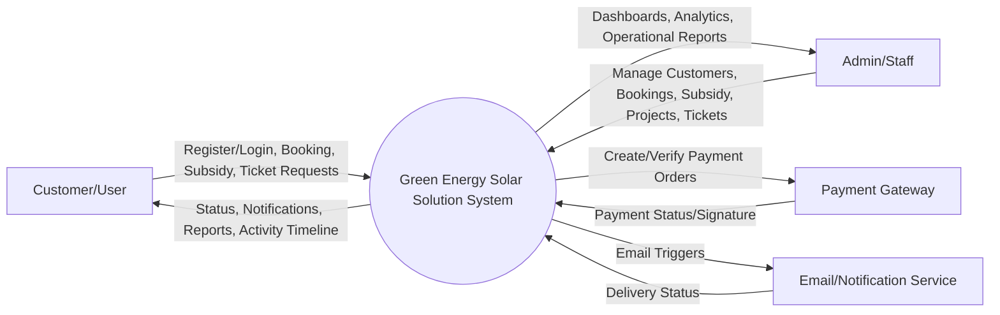
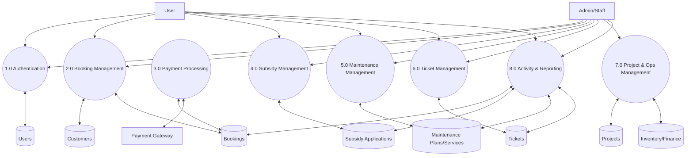
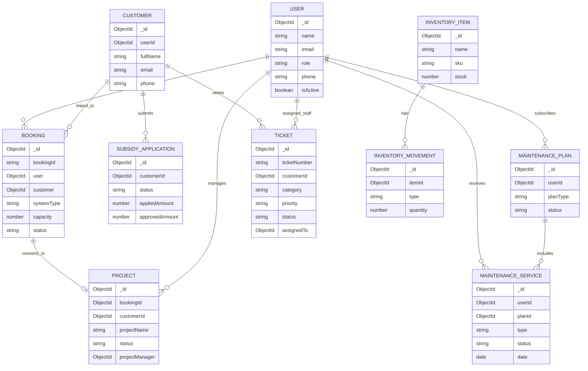
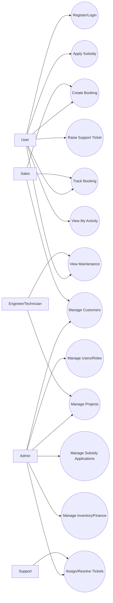
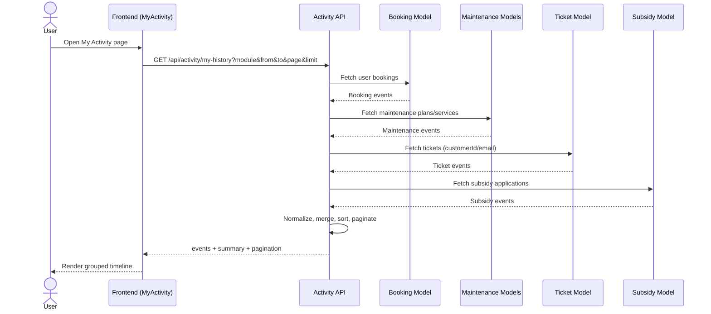
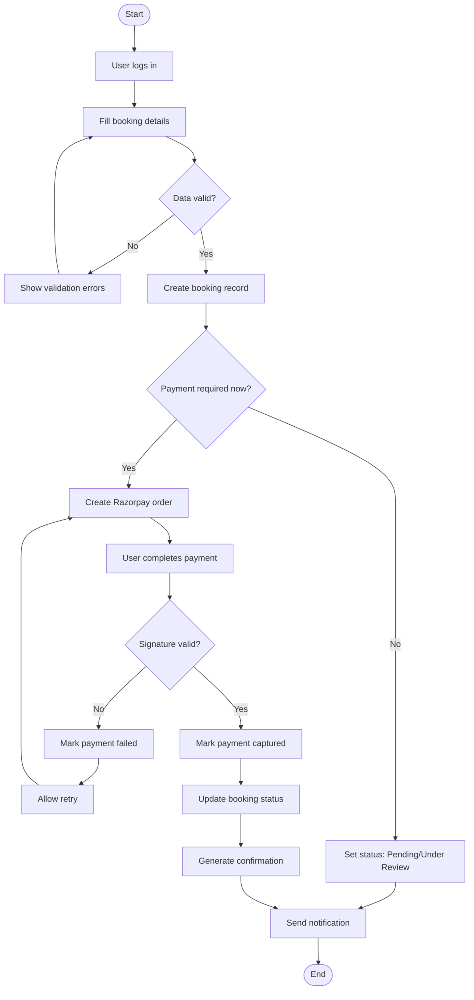

# Diagram Pack (Mermaid)
## Green Energy Solar Solution

This file contains ready-to-use Mermaid diagrams for:

1. System Architecture Diagram
2. DFD Level 0
3. DFD Level 1
4. ER Diagram
5. Use Case Diagram
6. Sequence Diagram
7. Activity Diagram
8. Component Diagram
9. Deployment Diagram

---

## 1. System Architecture Diagram

```mermaid
flowchart TB
  subgraph ClientLayer[Presentation Layer]
    UI[React Frontend]
    PUB[Public Pages]
    USERD[User Dashboard]
    ADMIND[Admin/CRM Dashboard]
  end

  subgraph AppLayer[Application Layer - Node.js + Express]
    API[REST API Gateway]
    AUTH[JWT Auth + Refresh + OAuth]
    RBAC[Role-Based Access Middleware]
    BIZ[Business Modules\nBooking | Maintenance | Subsidy | Tickets | Projects | Inventory | Finance | Activity]
  end

  subgraph DataLayer[Data Layer]
    MDB[(MongoDB)]
    UP[(Uploads Storage)]
  end

  subgraph External[External Services]
    RZ[Razorpay]
    GOOG[Google OAuth]
    MAIL[Email Service]
  end

  UI --> API
  PUB --> UI
  USERD --> UI
  ADMIND --> UI

  API --> AUTH
  AUTH --> RBAC
  RBAC --> BIZ
  BIZ --> MDB
  BIZ --> UP

  AUTH --> GOOG
  BIZ --> RZ
  BIZ --> MAIL
```

---

## 2. DFD Level 0 (Context Diagram)



---

## 3. DFD Level 1



---

## 4. ER Diagram



---

## 5. Use Case Diagram



---

## 6. Sequence Diagram (My Activity Flow)



---

## 7. Activity Diagram (Booking + Payment)



---

## 8. Component Diagram

```mermaid
flowchart TB
  subgraph Frontend
    APP[App Router]
    COMP[UI Components]
    SRV[Service Layer (Axios APIs)]
    GUARD[ProtectedRoute + Role Guard]
  end

  subgraph Backend
    ROUTES[Route Modules]
    CTRL[Controllers]
    MW[Middleware (Auth/RBAC)]
    MODELS[Mongoose Models]
    UTILS[Utils/Services (Email/PDF/Excel)]
  end

  subgraph DataAndExternal
    DB[(MongoDB)]
    RZ[Razorpay]
    OAUTH[Google OAuth]
    FILES[(Uploads)]
  end

  APP --> COMP
  APP --> GUARD
  COMP --> SRV
  SRV --> ROUTES

  ROUTES --> MW
  MW --> CTRL
  CTRL --> MODELS
  CTRL --> UTILS

  MODELS --> DB
  CTRL --> RZ
  MW --> OAUTH
  CTRL --> FILES
```

---

## 9. Deployment Diagram

```mermaid
flowchart LR
  subgraph ClientDevices
    BROWSER[Web Browser\n(User/Admin/Staff)]
  end

  subgraph CloudHost[Application Hosting (Render or Similar)]
    FEHOST[Frontend Static Build]
    BEHOST[Node.js + Express API Service]
  end

  subgraph DataServices
    MONGO[(MongoDB Atlas)]
    STORAGE[(Uploads Storage)]
  end

  subgraph ThirdParty
    RAZORPAY[Razorpay API]
    GOOGLE[Google OAuth]
    SMTP[Email Service]
  end

  BROWSER --> FEHOST
  FEHOST --> BEHOST
  BEHOST --> MONGO
  BEHOST --> STORAGE
  BEHOST --> RAZORPAY
  BEHOST --> GOOGLE
  BEHOST --> SMTP
```

---

## Usage Note

- Copy each Mermaid block into your report (or Mermaid-enabled markdown editor) to generate clean diagrams.
- In MS Word, export rendered diagrams as PNG/SVG and add figure numbering/captions.
- Keep diagram numbering aligned with your Chapter 4 and Chapter 7 references.
